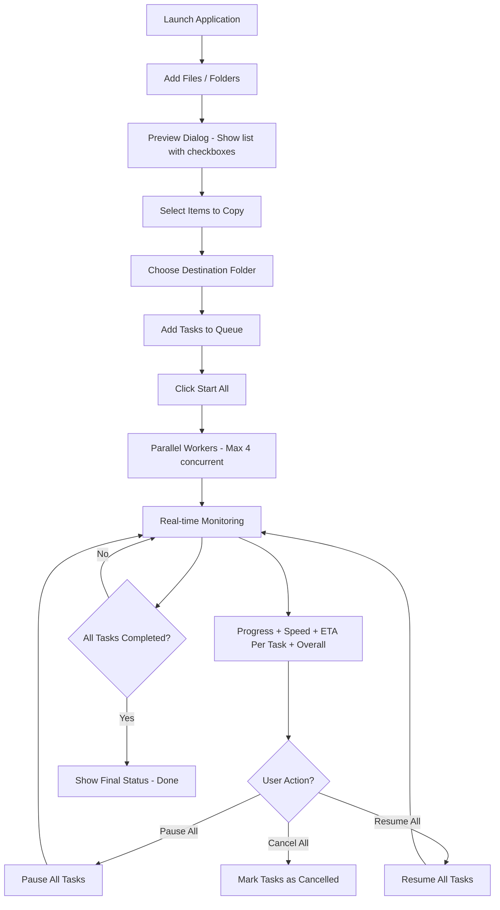

# FileCopierPro 🚀

**A modern, fast, and powerful parallel file copier** built with PySide6 (Qt for Python).

Designed for users who need **speed, control, and clarity** while copying large numbers of files or entire folders.


---

## ✨ Key Features

| Feature                        | Description |
|-------------------------------|-----------|
| **Parallel Copying**          | Copy up to 4 files/folders simultaneously for maximum speed |
| **Preview & Selection**       | Full preview dialog with checkboxes — select exactly what you want to copy |
| **Folder Support**            | Recursively copies entire directories while preserving structure |
| **Real-time Progress**        | Live updates with percentage, speed, ETA, and copied size |
| **Pause / Resume / Cancel**   | Full control — pause, resume or cancel any task individually or globally |
| **Overall Progress**          | Global progress bar showing combined status of all tasks |
| **Human-Readable Stats**      | Shows file sizes in MB/GB, speed in MB/s, and friendly ETA format |
| **Modern Dark UI**            | Clean, compact, professional dark theme with smooth interface |
| **Error Handling**            | Graceful error handling with failed task visibility |

---

## 🚀 Workflow

### How It Works (Step by Step):

1. **Add Sources**  
   Click "Add Files / Folders" → Select multiple files and/or folders.

2. **Preview & Select**  
   A clean preview dialog appears showing all selected items with checkboxes.  
   You can **Select All / Deselect All** and choose exactly which items to copy.

3. **Choose Destination**  
   Select the target folder where files/folders will be copied.

4. **Queue Tasks**  
   All selected items are added to the task list with "queued" status.

5. **Start Copying**  
   Click "Start All" → Up to 4 tasks run in parallel using separate threads.

6. **Monitor Progress**  
   Watch real-time updates:
   - Progress percentage per task
   - Current speed (MB/s)
   - Estimated Time Remaining (ETA)
   - Overall progress bar

7. **Control Tasks**  
   Use **Pause All**, **Resume All**, or **Cancel All** anytime.

8. **Completion**  
   Once done, you'll see clear status (`done`, `cancelled`, or `failed`).

---

## 📊 Workflow Diagram



---

## 📸 Screenshots

### 1. Main Application Window
.png)

### 2. Add Files & Folders + Preview Dialog
.png)

### 3. Real-time Copying in Progress
.png)

### 4. Pause / Resume / Cancel Controls
.png)

### 5. Overall Progress & Completed Tasks
.png)

---

## 🛠 Project Structure

```
FileCopierPro/
├── main.py                     # Application entry point
├── core/
│   ├── task.py                 # FileTask dataclass
│   ├── worker.py               # CopyWorker (QThread logic)
│   └── file_engine.py          # Core copy logic (file + folder)
├── ui/
│   ├── main_window.py          # Main UI + logic
│   └── preview_dialog.py       # Preview & selection window
├── utils/
│   └── formatter.py            # Human readable size, speed, ETA
├── README.md
└── requirements.txt
```

---

## 💾 Installation & Usage

### Option 1: Run from Source

```bash
git clone https://github.com/muzzamil7770/FileCopierPro.git
cd FileCopierPro

# Create virtual environment
python -m venv venv
venv\Scripts\activate

# Install dependencies
pip install PySide6

# Run the application
python main.py
```

### Option 2: Download Executable (Recommended)

Go to the [Releases](https://github.com/muzzamil7770/FileCopierPro/releases) page and download `FileCopierPro.exe`.

---

## 🔨 How to Build .exe

### Simple Build (Recommended):

```powershell
pyinstaller --name "FileCopierPro" --windowed --onefile --clean --noconfirm main.py
```

### Build with PySide6 Plugins (if needed):

```powershell
pyinstaller --name "FileCopierPro" --windowed --onefile --clean --noconfirm `
  --add-data "venv\Lib\site-packages\PySide6\plugins;PySide6\plugins" main.py
```

The `.exe` will be generated in the `dist/` folder.

---

## 🛣️ Future Roadmap

- [ ] Drag & Drop support
- [ ] Light/Dark theme toggle
- [ ] Copy history & logging
- [ ] Speed graph visualization
- [ ] Queue save/load functionality
- [ ] Multi-language support
- [ ] Progress bar per task with color coding

---

## 🧪 Technologies Used

- Python 3.10+
- PySide6 (Qt6 for Python)
- PyInstaller (for creating .exe)
- Threading + Signals/Slots for smooth UI updates

---

## 📄 License

This project is licensed under the MIT License — feel free to use, modify, and distribute.

---

Made with ❤️ for fast, reliable, and beautiful file copying experience.
